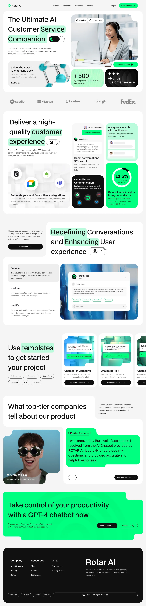

# Rotar AI

## 📌 Descripción del Proyecto / Project Description

 
Rotar AI es un proyecto web desarrollado con React. El diseño está basado en un mockup visual previamente elaborado y presenta una interfaz moderna, interactiva y amigable. Cada sección ha sido pensada para mejorar la experiencia del usuario mediante interacciones fluidas, animaciones y componentes visuales dinámicos.

Rotar AI is a web project developed with React. The design is based on a previously created visual mockup and features a modern, interactive, and user-friendly interface. Each section is designed to enhance the user experience through smooth interactions, animations, and dynamic visual components.

## ⚙️ Tecnologías / Technologies

- React  
- CSS Modules  
- AOS (Animate On Scroll)  
- i18next (Multilingual Support)
- React CountUp (Animate) 

## 💡 Características / Features

- Diseño visual basado en un mockup / Visual design based on a mockup  
- Contenido en español e inglés / Spanish and English content  
- Componente interactivo con acordeón e ilustraciones dinámicas / Interactive accordion component with dynamic illustrations  
- Animaciones suaves al hacer scroll / Smooth scroll animations  
- Estructura modular y reutilizable / Modular and reusable structure

## 🖼️ Vista del Mockup / Mockup Preview

